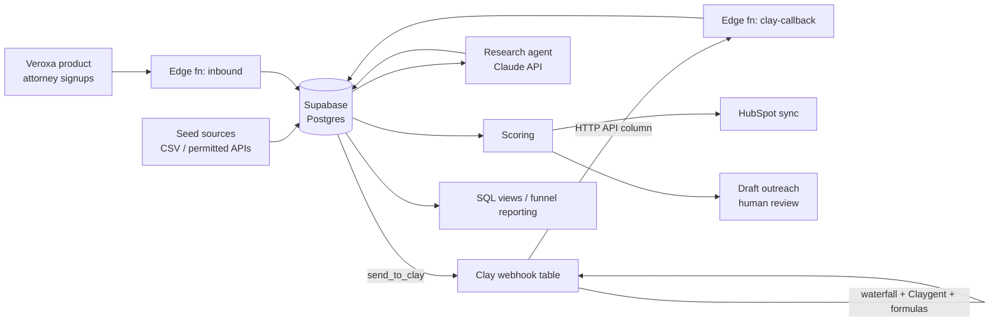

# Veroxa GTM Pipeline: Kickoff Spec

> Drop this file in the repo root (or merge into `CLAUDE.md`) and point Claude Code at it.
> Owner: Will · Status: v0.1 · Scope: attorney-side outbound + inbound routing

## 1. Goal

Veroxa is a record-keeping product for family court: parents in custody cases keep organized, court-ready records and share them with their attorney. It sells to parents directly and to family law firms. This pipeline is the firm side of go-to-market.

Build a production-grade go-to-market pipeline for Veroxa that:

1. Finds and qualifies NJ/NY family law firms that handle custody matters.
2. Enriches them through Clay, scores them, and drafts personalized outreach.
3. Syncs qualified records to HubSpot and reports the full funnel in SQL.
4. Mirrors attorney-intent inbound signups from the Veroxa product (parents stay in the product; ADR 0002).

Secondary goal: every component doubles as a portfolio piece for GTM Engineer roles, so favor clean code, logging, tests, and written decisions over clever shortcuts.

## 2. Non-goals and guardrails

- **No prospecting of individual parents.** Parents arrive only via inbound (site, content, communities). Never use court records, dockets, or case filings as a lead source.
- **No unofficial Clay automation.** No cookie/session-based Clay MCP servers. The runtime pipeline talks to Clay only through webhook tables (in) and HTTP API columns (out).
  - **Allowed (2026-09-29): Clay's official MCP server at `https://api.clay.com/v3/mcp`,** connected by Will, for development-time use by Claude Code (like the Supabase MCP in §4), not by the runtime pipeline. It can't read workbook tables (§4); its search and enrichment tools need Will's go-ahead before use.
- **No auto-send.** Outreach is drafted by the pipeline and sent by Will after review.
- **Respect sources.** Only use data sources whose terms permit this use. Don't scrape directories that prohibit it.
- **Attorney messaging:** accurate claims only, no guarantees of outcomes, CAN-SPAM compliant (physical address, unsubscribe honored).

## 3. Architecture



**Source of truth:** Supabase. Clay and HubSpot are processors/mirrors; every record they touch has a row in Supabase with an event history.

## 4. Stack

| Layer | Choice | Notes |
|---|---|---|
| Language | TypeScript | Node 20+ for scripts, Deno for Supabase Edge Functions |
| Database | Supabase Postgres | RLS on; service-role key only server-side |
| Webhooks | Supabase Edge Functions | `clay-callback`, `inbound` |
| Enrichment | Clay (free tier to start) | Webhook table in, HTTP API column out |
| AI | Claude API | Research agent + outreach drafts, JSON outputs |
| CRM | HubSpot Free | Service Key (beta; `Authorization: Bearer`, REST API only, no webhooks) |
| Scheduling | Supabase cron (pg_cron) or GitHub Actions | Batch runs |
| Tests | Vitest | Unit + contract tests |

### MCP servers for Claude Code (development-time)

Add in this order; confirm each server's current install instructions before adding:

1. **Supabase**: schema, migrations, SQL.
2. **HubSpot**: inspect objects/properties while building the sync (use the official server if available; otherwise the REST API is fine).
3. **GitHub**: issues/PRs.
4. **Linear** (optional): task tracking for milestones.
5. **Clay (official, `https://api.clay.com/v3/mcp`)**: it can't read workbook tables (checked 2026-09-29). Its tools cover the workspace, the enrichment function list, public company/people search, search task results, and Audiences, not table rows. Check tables like GTM Decision Makers through our database (`pipeline_events`, `contacts`) or with screenshots. Its search and enrichment tools create tasks or spend credits, so ask Will before using them; see §2.

MCP is for building and operating the system. The runtime pipeline itself calls APIs directly so it runs without Claude Code attached.

## 5. Repo structure

```
veroxa-gtm/
├── CLAUDE.md                  # conventions + pointer to this spec
├── SPEC.md
├── docs/decisions/            # ADRs: one short file per decision
├── supabase/
│   ├── migrations/
│   └── functions/
│       ├── clay-callback/
│       └── inbound/
├── src/
│   ├── seed/                  # import firms from CSV / sources
│   ├── clay/                  # send rows, payload types, contract tests
│   ├── research/              # Claude research agent + prompts
│   ├── scoring/               # scoring rules (pure functions)
│   ├── hubspot/               # upsert companies/contacts/deals
│   ├── outreach/              # draft generation
│   └── lib/                   # db client, logger, config, retry
├── evals/
│   ├── cases/                 # labeled firms for research-agent evals
│   └── run.ts
└── tests/
```

## 6. Data model (v1)

```sql
create type pipeline_status as enum (
  'new','sent_to_clay','enriched','researched','scored',
  'qualified','disqualified','synced','drafted','contacted','replied'
);

create table firms (
  id uuid primary key default gen_random_uuid(),
  name text not null,
  domain text unique,
  city text, state text,
  source text not null,                 -- where the row came from
  status pipeline_status not null default 'new',
  headcount_est int,
  handles_custody boolean,
  firm_size_band text,                  -- solo | small | mid | large
  uses_practice_mgmt text,              -- detected tool, if any
  fit_score int,
  hubspot_company_id text,
  created_at timestamptz default now(),
  updated_at timestamptz default now()
);

create table contacts (
  id uuid primary key default gen_random_uuid(),
  firm_id uuid references firms(id) on delete cascade,
  full_name text, title text,
  email text unique, email_source text, email_verified boolean,
  linkedin_url text,
  is_decision_maker boolean,
  hubspot_contact_id text,
  unsubscribed boolean default false,
  created_at timestamptz default now()
);

create table research (
  id uuid primary key default gen_random_uuid(),
  firm_id uuid references firms(id) on delete cascade,
  model text, prompt_version text,
  output jsonb not null,                -- structured result (see §8)
  evidence jsonb,                       -- URLs + snippets supporting output
  created_at timestamptz default now()
);

create table outreach_drafts (
  id uuid primary key default gen_random_uuid(),
  contact_id uuid references contacts(id) on delete cascade,
  subject text, body text,
  prompt_version text,
  status text default 'pending_review', -- pending_review | approved | sent | rejected
  created_at timestamptz default now()
);

create table inbound_signups (
  id uuid primary key default gen_random_uuid(),
  email text not null,
  persona text,                         -- attorney | parent | unknown
  form text, utm jsonb,
  routed_to text,
  created_at timestamptz default now()
);

create table events (                   -- append-only audit log
  id bigserial primary key,
  entity text, entity_id uuid,
  type text, payload jsonb,
  created_at timestamptz default now()
);
```

Keep inbound parent data minimal: email, persona, form, UTM. Nothing about their case.

## 7. Clay contract

### Outbound: Supabase → Clay webhook table

`POST {CLAY_WEBHOOK_URL}`

```json
{
  "firm_id": "uuid",
  "name": "Smith & Rivera Family Law",
  "domain": "smithrivera.com",
  "city": "Red Bank",
  "state": "NJ",
  "callback_secret_ref": "v1"
}
```

### Clay table columns (built in Clay UI)

1. Company enrichment from `domain` (headcount, location, description).
2. Find people: titles like Partner, Managing Attorney, Founder, Office Manager. **M3: one decision-maker per firm (Partner, Managing Attorney, Founder) as flat columns in the firm table, no people table; see ADR 0009.**
3. Email waterfall (2–3 providers) + verification.
4. Claygent: "Does this firm's website list child custody as a practice area? Answer yes/no/unclear with the URL as evidence."
5. HTTP API column → callback (below), runs only when steps 1–4 complete.

### Inbound: Clay → `clay-callback` edge function

`POST /functions/v1/clay-callback` with header `x-veroxa-secret: {CLAY_CALLBACK_SECRET}`

```json
{
  "firm_id": "uuid",
  "company": { "headcount": 6, "description": "..." },
  "custody": { "answer": "yes", "evidence_url": "https://..." },
  "people": [
    {
      "full_name": "Jane Rivera",
      "title": "Managing Partner",
      "email": "jane@smithrivera.com",
      "email_source": "provider_b",
      "email_verified": true,
      "linkedin_url": "https://..."
    }
  ]
}
```

**Rules:** reject bad secret (401); idempotent on `firm_id` + payload hash; validate with Zod; log raw payload to `events`; upsert contacts by email; advance status to `enriched`.

## 8. Research agent (Claude API)

Runs on `enriched` firms. Reads the firm's public site (home, practice areas, attorneys pages) and returns strict JSON:

```json
{
  "handles_custody": "yes|no|unclear",
  "firm_size_band": "solo|small|mid|large",
  "practice_areas": ["divorce","custody","..."],
  "serves_pro_se_or_limited_scope": "yes|no|unclear",
  "uses_practice_mgmt": "Clio|MyCase|none_detected|...",
  "personalization_hook": "one specific, verifiable detail",
  "evidence": [{"claim": "...", "url": "..."}]
}
```

- Every claim needs an evidence URL; "unclear" beats guessing.
- Version prompts (`prompt_version`) and store the model name.
- **Evals:** 25–30 hand-labeled firms in `evals/cases/`. `evals/run.ts` reports per-field accuracy and hook quality (1–5, graded by Will). Re-run on every prompt change and commit results.

## 9. Scoring v1 (transparent, pure function)

| Signal | Points |
|---|---|
| Handles custody = yes | +40 |
| Firm size solo/small | +20 |
| Offers limited-scope / unbundled services | +15 |
| Verified decision-maker email | +15 |
| In a target county (phase 1: Monmouth, Ocean NJ; see ADR 0006) | +10 |
| Handles custody = no | disqualify |

`qualified` if score ≥ 60. Store the breakdown, not just the total, so a rep (you) can see why.

## 10. HubSpot sync

- Upsert **company** by domain and **contact** by email; store returned IDs back in Supabase.
- Custom properties: `veroxa_fit_score`, `veroxa_score_breakdown`, `custody_evidence_url`, `pipeline_status`, `lead_source`.
- Create a **deal** in an "Attorney Pilot" pipeline only when a contact replies.
- Dedupe before create; never overwrite fields edited manually in HubSpot (track `last_synced_at`).

## 11. Outreach drafts

- Generated only for `qualified` + verified email + not unsubscribed.
- Inputs: research output + score breakdown. Output: subject + ≤120-word body using the personalization hook.
- Tone: peer-to-peer, asks for feedback or offers early access. No outcome claims.
- Stored as `pending_review`; a small CLI (`npm run review`) lets Will approve/edit/reject.

## 12. Inbound flow

Attorney-intent signups captured by the Veroxa product → `inbound` edge function → upsert `inbound_signups` → match the email to `contacts` and its domain to `firms` (a matched firm moves to `replied`) → attorneys upsert to HubSpot. Parents are never forwarded; their lifecycle email stays in the product. See ADR 0002.

## 13. Reporting (SQL views)

- `v_funnel`: counts by status per week.
- `v_enrichment_coverage`: % firms with verified decision-maker email, by provider.
- `v_score_distribution`
- `v_outreach_performance`: drafted → approved → sent → replied.

## 14. Build order (milestones)

| # | Milestone | Done when | Status |
|---|---|---|---|
| M1 | Repo, CLAUDE.md, Supabase schema + migrations | Migrations pass the local PGlite gate (ADR 0005; `supabase db reset` needs Docker); tests run | Complete 2026-09-28 |
| M2 | Seed importer | 30 firms loaded from CSV with `source` set | Complete 2026-09-28: 30 firms (18 Monmouth, 12 Ocean), `source = manual_csv` |
| M3 | Clay round-trip | 10 firms sent → enriched rows land via callback; contract tests pass | Complete 2026-09-28: 10/10 enriched via callback, 184 tests pass. Only 2 firms have a usable decision-maker contact; the other 8 went to the research agent (M4) |
| M4 | Research agent + evals | Eval set labeled; baseline accuracy recorded | |
| M5 | Scoring | Breakdown stored; ≥1 unit test per rule | |
| M6 | HubSpot sync | Qualified firms/contacts appear in HubSpot, no dupes on re-run | |
| M7 | Outreach drafts + review CLI | 10 drafts reviewed | |
| M8 | Inbound flow | Test signups routed correctly | |
| M9 | Reporting views + README case study | Loom-ready walkthrough | |

Write a short ADR in `docs/decisions/` for each non-obvious choice.

## 15. Config / secrets

`.env` (never committed): `SUPABASE_URL`, `SUPABASE_SERVICE_ROLE_KEY`, `ANTHROPIC_API_KEY`, `CLAY_WEBHOOK_URL`, `CLAY_CALLBACK_SECRET`, `HUBSPOT_SERVICE_KEY`.

## 16. Decisions (Will)

| Question | Decision | Record |
|---|---|---|
| Seed source for the first firms | Hand-built CSV (`name, website, city, county, state`), imported with `npm run seed`. No directory scraping or third-party lead APIs for v1. | ADR 0006 |
| Target counties for v1 | NJ: **Monmouth, Ocean** (phase 1). **Middlesex, Mercer** are phase 2. NY is out of scope for v1. | ADR 0006 |
| Email providers in the Clay waterfall | **Deferred to M3**, once free-tier credits are known. | open |
| Parent inbound with M8? | Parents are not forwarded to GTM at all; parent lifecycle stays in Veroxa. | ADR 0002 |

## 17. First prompt to give Claude Code

> Read SPEC.md. Start with milestone M1: scaffold the repo structure in §5, create the Supabase migration for §6, add a typed db client and logger in `src/lib`, set up Vitest, and write CLAUDE.md with our conventions (TypeScript strict, Zod validation at every boundary, append to `events` for every state change, no secrets in code). Stop after M1 and summarize what you built and any decisions you made.
